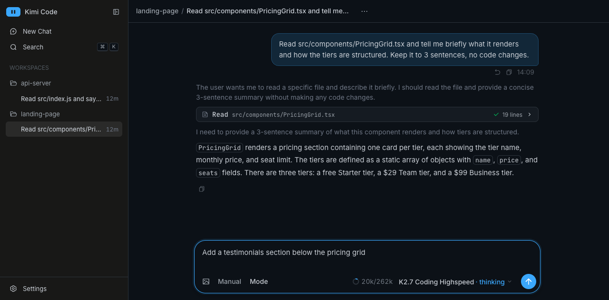
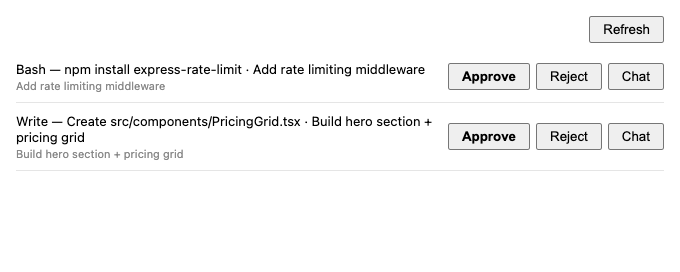
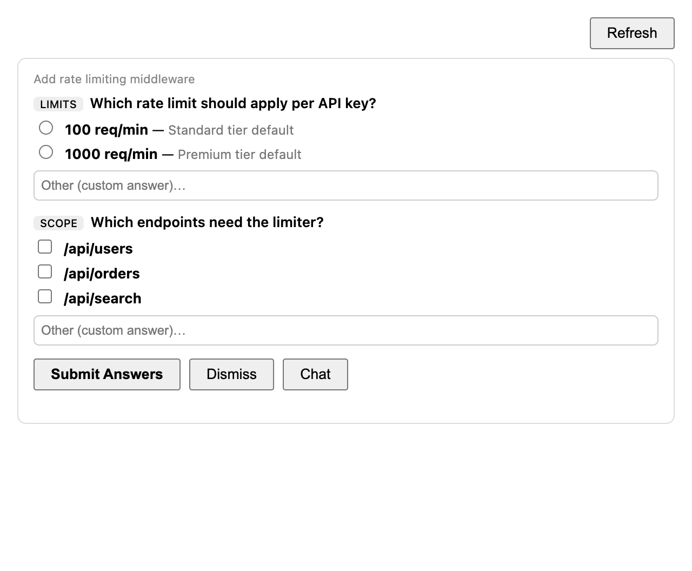
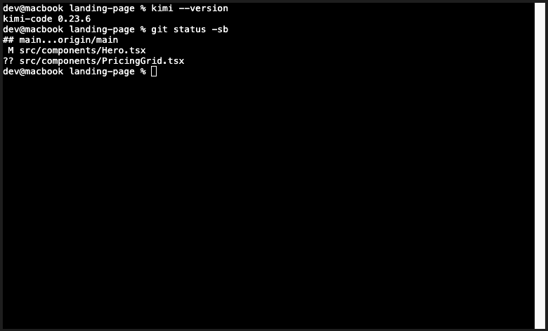
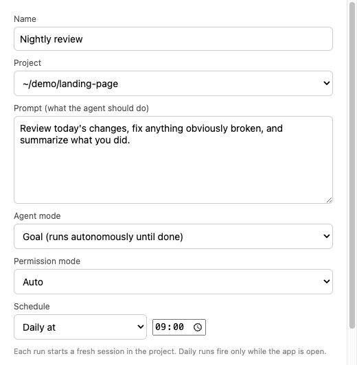
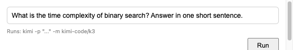

<div align="center">


# Kimi Code Desktop

**A native macOS app for [Kimi Code](https://moonshotai.github.io/kimi-code/) — like the Claude desktop app, but for Kimi.**

Launch it from Spotlight, get a real Dock icon, native menus, a global ⌥Space shortcut,
and every agent mode the CLI has — without ever opening a terminal.



</div>

> [!NOTE]
> **Unofficial project.** Not affiliated with, endorsed by, or supported by Moonshot AI.
> This is a community-built wrapper around Kimi Code's own local web UI. For the official
> CLI, see [moonshotai/kimi-code](https://moonshotai.github.io/kimi-code/).

---

## Why

Kimi Code ships a genuinely good local web UI — but it's a `kimi web` command and a
browser tab. Browser tabs get lost, don't have a Dock icon, don't survive a restart, and
can't fire a system notification when an agent needs your approval.

Everything Kimi already knows how to do is exposed over a local REST + WebSocket API on
`127.0.0.1`. So this app doesn't reimplement the chat UI — it **wraps the real one** and
spends its effort on the things a desktop app is actually good at: OS integration.

The result: no terminal, no lost tabs, and the agent can tap you on the shoulder.

## Install

Requires **macOS (Apple Silicon)** and the Kimi Code CLI:

```bash
npm install -g @moonshot-ai/kimi-code@latest   # needs 0.28+
```

Then build the app:

```bash
git clone https://github.com/schmoenraad/kimi-desktop.git
cd kimi-desktop
npm install
npm run package
cp -R "dist/Kimi Code-darwin-arm64/Kimi Code.app" /Applications/
```

Open it from Spotlight (⌘Space → "Kimi Code"). It starts the Kimi server itself if it
isn't running, and shares your existing CLI login — if `kimi` works in your terminal, the
app opens straight into chat.

## What it adds

### Desktop integration
- **⌥Space from anywhere** — show/hide the window like a quick-launcher
- **Menu bar icon** — show window, open project, restart/stop the server, quit
- **Check for Updates…** — compares the app against GitHub releases and the
  CLI against npm, and offers the download or the built-in CLI upgrade
- **Native notifications** when a session needs approval or asks a question —
  with native **Pending Approvals** / **Pending Questions** windows to answer
  them without focusing the chat
- **Launch at Login**, window state restored, external links open in your browser
- Auto-starts the Kimi server on launch and injects its auth token, so reloads
  never hit the token wall





### Projects
- **⌘O** — open any folder as a Kimi workspace; **⌘⇧N** creates a new project folder
- **Recent Projects** in the File menu and the Dock right-click menu
- **Open Current Project In** → Finder / Terminal / iTerm / VS Code / Cursor
- **Add Project Instructions (AGENTS.md)** — Kimi's equivalent of `CLAUDE.md`

### Skills
Skills are reusable instructions Kimi loads automatically when relevant — same
`SKILL.md` format as Claude skills. The app ships two starters (**code-review**,
**commit-messages**), lists every installed skill in the Skills menu, and scaffolds new
ones from a template.

### Sessions & agents
- **Nudge (⌘⇧M)** — queue a one-liner into a running session, or **Steer Now** to inject
  it straight into the active turn (needs kimi-code ≥ 0.38)
- **Abort (⌘.)**, Fork, Compact, Undo Last Turn, Archive/Restore, Export
- **Background Tasks** — live list across sessions, with cancel buttons
- **Terminal (⌘⇧T)** — a real PTY (xterm.js) attached to the session's workspace
- **Browser pane (⌘⇧B)** — a companion browser docked beside the chat
- **Plan Usage** — your real quota windows (5-hour and weekly) with reset times,
  plus per-session token totals



### Workflows
Save a recurring agent run — project + prompt + agent mode (Goal / Swarm / Plan) +
permission mode + model + an optional daily time. One click from the Workflows menu;
daily runs fire while the app is open. Pin a cheaper model to scheduled runs.



### Models & providers
- **Model menu** — switch models (including **Kimi K3**) from the menu bar; the window
  title shows the active one
- **Add API Provider** — bring your own keys (Anthropic, OpenAI, Gemini, Kimi, or any
  OpenAI-compatible endpoint), validated against `kimi doctor`

### Quick Prompt
**⌘⇧P** — ask a one-off question without opening the chat UI. Runs `kimi -p` and shows
the answer in its own window.



## How it works

```
┌─────────────────────────┐
│  Kimi Code.app          │   Electron shell — menus, shortcuts,
│  (main.js)              │   notifications, dialogs, tray
└───────────┬─────────────┘
            │  REST + WebSocket on 127.0.0.1:58627
┌───────────▼─────────────┐
│  kimi web  (server)     │   official Kimi Code server + web UI
└───────────┬─────────────┘
            │
       api.kimi.com
```

The app spawns `kimi web --no-open`, waits for the port, reads the server's auth token
from `~/.kimi-code/server.token`, and loads the UI in a `BrowserWindow`. Native features
talk to the same local API the web UI uses (`/api/v1/sessions`, `/workspaces`,
`/approvals`, …). Nothing is proxied through a third party — your traffic goes straight
from the official server to Kimi.

Since kimi-code 0.28 the server is a foreground process (no background daemon). The app
tracks the pid it spawned, stops the server gracefully through `POST /api/v1/shutdown`,
and follows the instance registry in `~/.kimi-code/server/instances/` if the server had
to drift to a free port.

State lives where the CLI already keeps it: `~/.kimi-code/` for config, skills, sessions
and the server token.

## Development

```bash
npm start            # run from source
npm run package      # rebuild dist/Kimi Code.app
./scripts/seed-demo.sh && npm run screenshots   # regenerate README shots
```

Screenshots are captured offscreen against demo workspaces only — the capture script
hard fails if a real workspace or home path would appear in a published frame.

## Limitations

- **Apple Silicon macOS only.** Intel/Windows/Linux would need a different
  `--arch`/`--platform` and are untested.
- **Unsigned.** No Apple Developer certificate, so first launch may need
  right-click → Open. Nothing is notarized.
- **Daily workflows need the app open** — they're local timers, not server cron.
- The Kimi server keeps running after you quit (it's shared with the CLI).
  Stop it with **Kimi Code → Stop Kimi Server**.
- The app is unsigned, so **Check for Updates…** notifies and opens the
  download page rather than installing in place.
- Built against Kimi Code **0.32.0**. It reads the server's REST API and
  `config.toml`, so a future Kimi release could move something underneath it.

## License

[MIT](LICENSE) — do what you like. "Kimi" and "Kimi Code" are trademarks of Moonshot AI;
this project is not affiliated with them.
